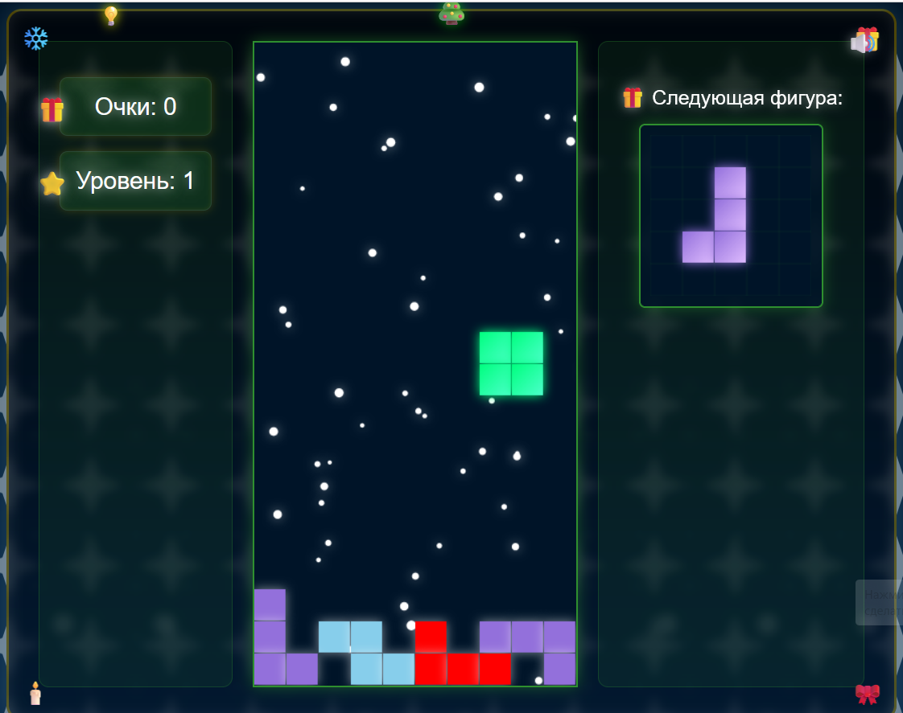

# 🎄 Новогодний Тетрис

Праздничная версия классической игры Тетрис с новогодним оформлением, анимациями и звуковыми эффектами.

## 🎮 Как играть

### Управление
- **←** (Стрелка влево) - Перемещение фигуры влево
- **→** (Стрелка вправо) - Перемещение фигуры вправо
- **↓** (Стрелка вниз) - Ускорение падения фигуры
- **↑** (Стрелка вверх) - Вращение фигуры
- **Пробел** - Мгновенное падение фигуры

### Правила игры
1. Управляйте падающими фигурами, чтобы заполнять горизонтальные линии
2. За каждую заполненную линию начисляются очки
3. Чем больше линий очищено за раз, тем больше очков
4. Каждые 10 линий игра переходит на новый уровень
5. С каждым уровнем скорость падения фигур увеличивается
6. Игра заканчивается, когда новая фигура не может быть размещена на поле

## 🎵 Звуковые эффекты
- Фоновая новогодняя музыка
- Звуки перемещения и вращения фигур
- Праздничные звуки при очистке линий
- Колокольчики при повышении уровня
- "Хо-хо-хо" при окончании игры

## 🛠️ Установка и запуск

1. Скачайте все файлы проекта
2. Создайте папку `sounds` и добавьте в неё следующие аудиофайлы:
   - move.mp3
   - rotate.mp3
   - drop.mp3
   - jingle.mp3
   - bells.mp3
   - ho-ho-ho.mp3
   - christmas-music.mp3
3. Откройте файл `index.html` в веб-браузере

## ✨ Особенности
- Праздничное оформление с падающим снегом
- Анимированный Дед Мороз
- Новогодние фигуры (сосулька, ёлка, подарок, звезда и др.)
- Праздничная цветовая схема
- Мерцающие гирлянды
- Эффекты свечения
- Адаптивный дизайн

## 🔧 Технические требования
- Современный веб-браузер с поддержкой HTML5 Canvas
- Включенный JavaScript
- Поддержка воспроизведения аудио в формате MP3

## 🎨 Кастомизация
Вы можете настроить игру под себя, изменяя следующие параметры в файлах:
- Цвета фигур в `tetris.js`
- Скорость падения и увеличения сложности
- Стили и анимации в `styles.css`
- Звуковые эффекты в папке `sounds`

## 📝 Лицензия
MIT License - используйте, модифицируйте и распространяйте как пожелаете!

## 🤝 Вклад в проект
Если у вас есть идеи по улучшению игры, создавайте Issue или Pull Request!

---
🎄 Счастливого Нового года и приятной игры! 🎮
